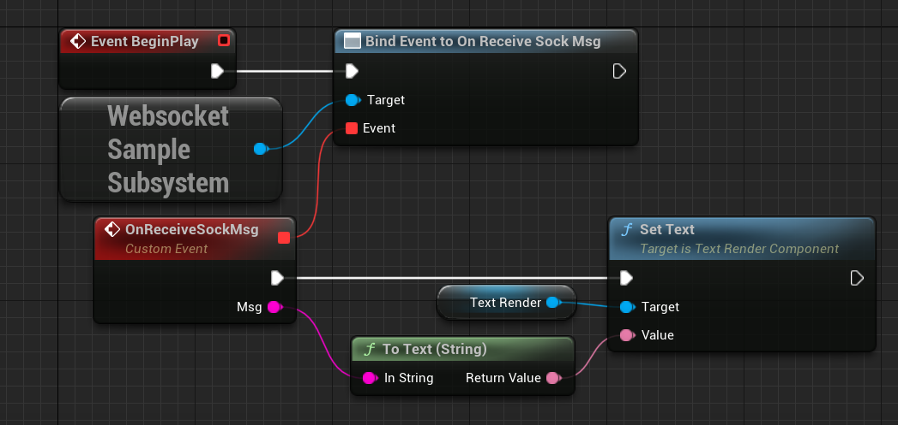

# UnrealWebsocket
UE5でWebsocketのClientを実装するサンプル。  
GameInstanceSubsystemを継承したSubsystem内にSocketを持ち、そこのイベントにBindすることでメッセージを得ることができる。  

## BP実装
`Game/MyContent/BP/BP_WebSocket` を参照

## C++実装
`Plugins/Websock_Sample` を参照  
